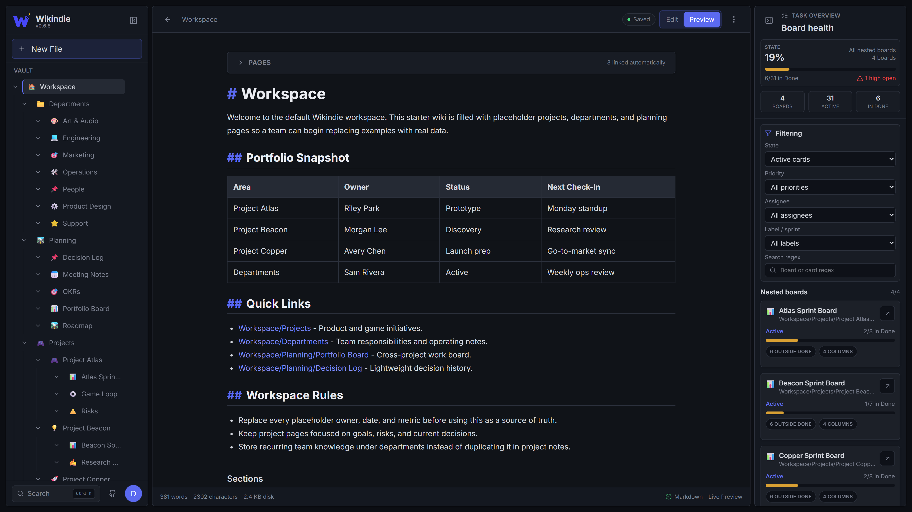
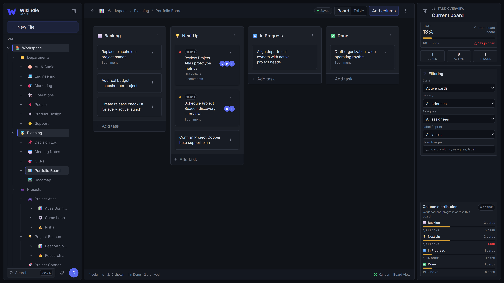
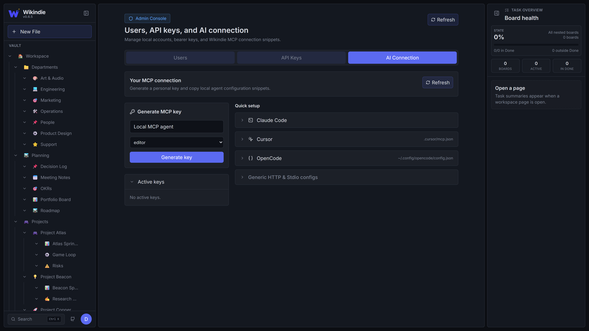

# Wikindie

**Your wiki. Your files. Your AI.** A self-hosted, MCP-native Markdown wiki and kanban for indie devs and small teams. One container, one folder of `.md` files, no database.

[Live showcase](https://wikindie.dexgamedev.com) · [Docker quickstart](#try-it-in-60-seconds) · [Connect your AI](#connect-your-ai-in-30-seconds) · [Follow progress](https://wikindie.dexgamedev.com/page/Wikindie/Roadmap) · MIT



> One self-hosted container for the indie dev who does not want five different apps to run a small project.

Wikindie is a no-database wiki and lightweight kanban board for solo builders, tiny teams, and small organizations. Keep your product notes, specs, meeting notes, personal backlog, and delivery board in one place, stored as plain Markdown files you can back up, edit, diff, and move around like normal files.

It is also **agent-native**: a built-in MCP server lets Claude Code, Cursor, OpenCode, or Claude Desktop read, edit, and reorganize your workspace directly. Same Markdown files the UI shows, no scraping, no glue scripts.

## Why Wikindie

- **Plain `.md` files on disk.** Your workspace is a folder. `grep` it, `git` it, back it up by copying. If Wikindie disappears tomorrow, your wiki still opens in any text editor.
- **MCP-native, not bolted on.** One config line connects an AI agent to your workspace: pages, boards, frontmatter, comments, and all.
- **One container, no SaaS.** Self-host on a $5 VPS, share with a tiny team, or publish a read-only space to the world.

## See it work

| Pages | Kanban | Connect AI |
| --- | --- | --- |
|  |  |  |

The live showcase at [wikindie.dexgamedev.com](https://wikindie.dexgamedev.com) is itself a Wikindie instance running in public read-only mode, with its own Roadmap board as the live source of truth.

## Try it in 60 seconds

macOS / Linux:

```bash
docker run -d -p 3000:3000 -v $(pwd)/space:/space \
  -e WIKINDIE_USER=you:your-strong-password \
  -e JWT_SECRET=$(openssl rand -hex 32) \
  ghcr.io/dexgamedev/wikindie:latest
```

Windows (PowerShell):

```powershell
docker run -d -p 3000:3000 -v "${PWD}/space:/space" `
  -e WIKINDIE_USER=you:your-strong-password `
  -e JWT_SECRET=$(-join ((48..57) + (97..102) | Get-Random -Count 64 | ForEach-Object {[char]$_})) `
  ghcr.io/dexgamedev/wikindie:latest
```

Open `http://localhost:3000`, sign in with the credentials above, and you have a working wiki. Your workspace lives in `./space` on the host as plain Markdown files.

For Docker Compose, reverse proxies, and production hardening, see [Self-hosting](#self-hosting).

## Connect your AI in 30 seconds

After you generate an API key in **Account menu → Connect to AI**, add Wikindie as an MCP server to Claude Code:

```bash
claude mcp add wikindie -t http https://your-wikindie.example.com/mcp \
  --header "Authorization: Bearer wk_YOUR_API_KEY"
```

That is the entire setup. Open Claude Code in any project and the `wikindie` MCP tools are available globally. Cursor, OpenCode, and Claude Desktop are supported too, with the UI auto-generating connection snippets for each (your key already filled in).

The agent sees the same workspace you do: pages, sections, kanban cards, frontmatter, labels, priorities, comments. Stable page IDs in frontmatter survive renames so agent references don't break mid-session. Drop an `_AGENT.md` at the root of `SPACE_DIR` and every connecting client gets the same workspace-level instructions.

## Features

- **Markdown pages on disk.** Each page is a file, not a database row.
- **Nested page tree** with drag-and-drop moves and stable `id: pg_...` frontmatter references.
- **Modular page sections** stored as separate Markdown files, composed via frontmatter.
- **Kanban boards** serialized as plain Markdown bullet lists, with columns, cards, labels, priorities, archive, task comments, and table view.
- **MCP server** at `/mcp` (Streamable HTTP) plus a stdio bridge for desktop clients.
- **Workspace agent instructions** via `_AGENT.md` for repo-wide AI house rules.
- **HTTP API** for pages, sections, frontmatter, boards, tasks, and comments.
- **Public read-only mode** for sharing a workspace as a public site.
- **Role-based access** for admin, editor, and readonly. Revocable `wk_`-prefixed API keys.
- **Realtime UI.** Page and board changes push to connected clients over WebSocket.
- **Docker image** that serves the built frontend from the backend on a single port.

## Local development

Requires Node.js 22 or newer.

```bash
npm install
npm run dev
```

Open `http://localhost:5173`. The API runs on `http://localhost:3000` and Vite proxies API and WebSocket traffic during development. Local development defaults to `dev:dev` unless `WIKINDIE_USER` is set, and the workspace lives at `packages/backend/space`.

## Stack

- React 19, Vite 7, Tailwind CSS 4, Zustand, React Router, TipTap, BlockNote.
- Express 5, TypeScript, `ws`, `chokidar`, `gray-matter`, MCP SDK (Streamable HTTP).
- npm workspaces for `packages/frontend` and `packages/backend`.

## Self-hosting

Docker Compose reads environment values from your shell or a root `.env` file. Start from `.env.example` and replace the credentials before running the container.

```bash
cp .env.example .env
docker compose up --build
```

The compose file mounts `./space` into the container as `/space`, so your Docker workspace lives in a root-level `space` directory.

### Production data safety

Production deployments must mount `SPACE_DIR` to persistent storage. The container filesystem is disposable and must not be treated as workspace storage.

Common production settings when mounting storage at `/space`:

```bash
NODE_ENV=production
SPACE_DIR=/space
```

If `SPACE_DIR` is not set in the Docker image, Wikindie uses `./space`, which resolves to `/app/space` because the container workdir is `/app`. Mount persistent storage at `/app/space` and omit `SPACE_DIR`, or mount at another path such as `/space` and set `SPACE_DIR` to match.

For hosted Docker platforms (CapRover, Coolify, etc.), configure the workspace path as persistent storage before first start. The path inside the container must match `SPACE_DIR`; if `SPACE_DIR` is unset, use `/app/space`. Do not change the mounted workspace path after data exists unless you also migrate the files.

In production, Wikindie starts with an empty workspace when the configured directory is empty. It does not seed placeholder content unless you explicitly opt in with `WIKINDIE_INIT_DEFAULT_SPACE=true` for the first start only. This prevents a bad deploy or missing volume mount from silently replacing your real workspace.

Workspace metadata lives alongside your Markdown:

```text
<SPACE_DIR>/.wikindie/users.json
<SPACE_DIR>/.wikindie/apikeys.json
```

Keep this hidden `.wikindie` directory with the rest of your workspace data. Backups are "copy the folder", so `tar`, `git`, or `rsync` all work fine because Wikindie does not lock files.

### Environment

| Variable | Default in development | Description |
| --- | --- | --- |
| `WIKINDIE_USER` | `dev:dev` | Login credentials in `username:password` format. Required in production. |
| `JWT_SECRET` | Dev-only fallback | Secret used to sign session tokens. Required in production. |
| `SPACE_DIR` | `./space` | Directory containing Markdown workspace files, resolved from the backend process working directory. |
| `WIKINDIE_INIT_DEFAULT_SPACE` | unset | Set to `true` only when you want to seed the starter/demo workspace into an empty `SPACE_DIR`. |
| `WIKINDIE_PUBLIC_READONLY` | unset | Set to `true` to let anonymous visitors browse read-only while keeping writes behind login. |
| `WIKINDIE_PUBLIC_DEFAULT_PAGE` | unset | Page path to open from `/` in public showcase mode, such as `Wikindie`. |
| `WIKINDIE_ALLOWED_HOSTS` | unset | Comma-separated hostnames allowed to serve the app, such as `wiki.example.com`. Unknown hosts return 404. |
| `WIKINDIE_CORS_ORIGINS` | unset | Optional comma-separated origins allowed for cross-origin API calls. If omitted, allowed hosts are used when configured. |
| `WIKINDIE_LOGIN_RATE_LIMIT_MAX` | `10` | Maximum login attempts per client IP in the rate-limit window. |
| `WIKINDIE_LOGIN_RATE_LIMIT_WINDOW_MS` | `900000` | Login rate-limit window in milliseconds. |
| `PORT` | `3000` | Backend HTTP port. |

`.env.example` documents the expected variables, but the Node app does not automatically load `.env` files. Pass variables through your shell, process manager, Docker, or hosting platform.

Change `WIKINDIE_USER` and `JWT_SECRET` before exposing the app outside your local machine.

## Data model

Pages are Markdown files. Nested pages can be stored as either `Page.md` leaf files or `Page/_Index.md` index files with children. Frontmatter controls display metadata and board behavior. Wikindie also stores stable page IDs in frontmatter as `id: pg_...`; these IDs survive page moves and are preferred for agent references.

Sections are declared in page frontmatter and stored as additional Markdown files, usually under `_sections/` inside the page folder.

Kanban boards are Markdown files with `kanban: true` frontmatter. Each `## Heading` becomes a column and plain bullet items become cards; `kanbanColumns` frontmatter stores stable column IDs and workflow statuses. Completion is represented by moving cards into a column whose status is `done`. Archived cards use a trailing `!archived` metadata token. Labels use `#label`; `#high`, `#medium`, and `#low` are reserved for priority. Cards carry stable UIDs in HTML comments so task comments stay attached across edits and renames.

## MCP

Wikindie exposes a Model Context Protocol server at `/mcp`. Initial MCP auth uses existing `wk_` API keys as bearer tokens; OAuth is out of scope for the first version.

Use the **Connect to AI** menu entry to generate a personal API key and copy agent configuration snippets. Streamable HTTP clients connect directly:

```text
http://localhost:3000/mcp
Authorization: Bearer wk_...
```

For clients that only support stdio MCP servers, build the backend and use the stdio bridge:

```json
{
  "mcpServers": {
    "wikindie": {
      "command": "node",
      "args": ["/absolute/path/to/wikindie/packages/backend/dist/mcp-stdio.js"],
      "env": {
        "WIKINDIE_URL": "http://localhost:3000/mcp",
        "WIKINDIE_API_KEY": "wk_..."
      }
    }
  }
}
```

The MCP server exposes page/tree/search tools, page and section mutation tools, kanban task tools, task comment tools, workspace resources, and prompt templates. It also serves `_AGENT.md` from the workspace root as a workspace-level instructions resource. Use `readonly` keys for browsing and `editor` keys for agents that should update pages or boards.

## Project layout

```text
packages/backend   Express API, filesystem storage, WebSocket watcher, MCP server
packages/frontend  React application
scripts            Repository maintenance and screenshot scripts
```

## Scripts

| Command | Description |
| --- | --- |
| `npm run dev` | Run backend and frontend development servers. |
| `npm run build` | Build both packages and copy frontend assets into `packages/backend/public`. |
| `npm run start` | Start the built backend, serving the copied frontend assets. |
| `npm run typecheck` | Type-check backend and frontend workspaces. |
| `npm run screenshots` | Capture marketing/launch screenshots via Playwright (requires `playwright` installed; see `scripts/screenshots.mjs`). |

## Status

Active development, currently `0.6.x`. The live showcase at [wikindie.dexgamedev.com](https://wikindie.dexgamedev.com) runs the same image you can pull from GHCR. There is no automated test suite yet, so `npm run typecheck` and `npm run build` are the current verification commands.

## License

MIT license. Created by **Andy Lázaro** ([@dexgamedev on X](https://x.com/dexgamedev)).
